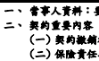
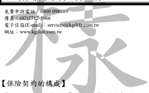

# 凱基人壽全民小額終身壽險 保單條款

(身故保險金或喪葬費用保險金、完全失能保險金、祝壽保險金)
【本保險為不分紅保險單】

※本契約於訂立契約前已提供要保人不低於三日之審閱期間。 ※本保險為不分紅保險單,不參加紅利分配,並無紅利給付項目。 ※本商品部分年齡可能發生累積所繳保險費超出身故保險金給付之情形。 ※本商品經本公司合格簽署人員檢視其內容業已符合一般精算原則及保險法令,惟為確保權益,基於保險公 司與消費者衡平對等原則,消費者仍應詳加閱讀保險單條款與相關文件,審慎選擇保險商品。本商品如有 虛偽不實或違法情事,應由本公司及負責人依法負責。

※投保後解約或不繼續繳費可能不利消費者,請慎選符合需求之保險商品。 ※ 保險契約各項權利義務皆詳列於保單條款,消費者務必詳加閱讀了解,並把握保單契約撤銷之時效(收到 保單翌日起算十日內)。

一、 當事人資料:要保人及保險公司。

(一) 契約撤銷權(第 3 條)。 (二) 保險責任之開始與契約效力停止、恢復及終止事由(第 4 條、第 6 條至第 8 條、第 10 條、第 23 條)。 (三) 保險期間及給付內容(第 5 條、第 13 條)。 (四) 告知義務與契約解除權(第 9 條)。 (五) 保險事故之通知、請求保險金應備文件與協力義務(第 11 條、第 12 條、第 14 條至第 16 條)。 (六) 除外責任及受益權之喪失(第 17 條、第 18 條)。 (七) 保險金額與保險期間之變更(第 20 條至第 22 條)。 (八) 保險單借款(第 23 條)。 (九) 受益人之指定、變更與要保人住所變更通知義務(第 26 條、第 27 條)。 (十) 請求權消滅時效(第 28 條)。

備查日期及文號:106.03.27 中壽商一字第 1060327002 號 修正日期及文號:107 年 09 月 10 日依金融監督管理委員會 107 年 06 月 07 日金管保壽字第 10704158370 號函修正 備查日期及文號:109.01.01 中壽商一字第 1090101026 號 備查日期及文號:109.07.01 中壽商一字第 1090701020 號 備查日期及文號:110.07.01 中壽商一字第 1100701005 號 修正日期及文號:112 年 01 月 01 日依金融監督管理委員會 111 年 08 月 30 日金管保壽字第 1110445485 號函修正 核准日期及文號:112.08.14 金管保壽字第 1120432605 號 備查日期及文號:113.01.01 凱壽商一字第 1133000002 號

第 一 條 本保險單條款、附著之要保書、批註及其他約定書,均為本保險契約(以下簡稱本契約)的構成部分。

本契約的解釋,應探求契約當事人的真意,不得拘泥於所用的文字;如有疑義時,以作有利於被保險人的 解釋為原則。

【名詞定義】
第 二 條 本契約所使用名詞定義如下:
一、繳費期間:係指保險單上所記載的繳費年限。 二、保險金額:係指保險單所載本契約之保險金額,若該金額有所變更時,以變更後之金額為準。 三、保險年齡:係指按投保時被保險人以足歲計算之年齡,但未滿一歲的零數超過六個月者加算一歲,以 後每經過一個保單年度加算一歲。

四、表定年繳保險費:係指本契約訂立時標準體之標準保險費率表所載之每萬元保險金額年繳保險費。 五、當年度保險金額:
(一) 第一保單年度至第三保單年度為「表定年繳保險費」之一點零二五倍乘以保單年度,再乘以保 險金額(以每萬元為單位)。

(二) 第四保單年度起係為「保險金額」。

六、醫師:係指領有醫師證書且合法執業者,且非被保險人或要保人本人者。 七、醫院:係指依照醫療法規定領有開業執照並設有病房收治病人之公、私立及醫療法人醫院。

【契約撤銷權】
第 三 條 要保人於保險單送達的翌日起算十日內,得以書面或其他約定方式檢同保險單向本公司撤銷本契約。
【EHJIPL】-1/9-

